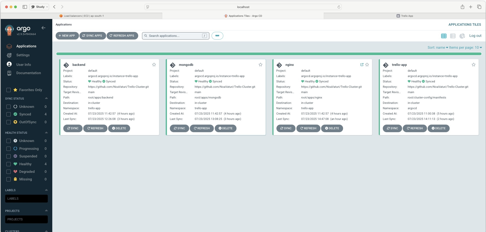
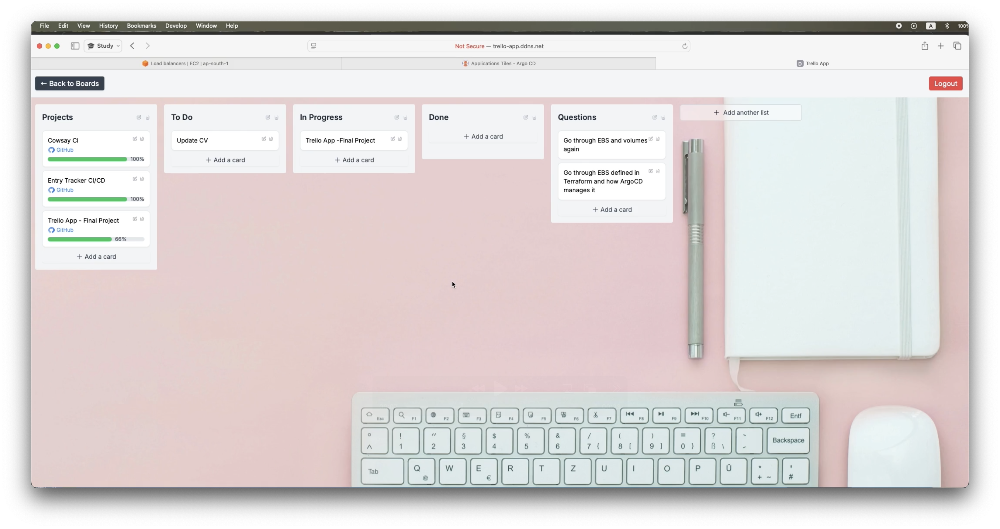

# 🧩 Trello Full DevOps Project

A full end-to-end DevOps pipeline for a microservices **Trello-like application**, built to demonstrate real-world CI/CD, Kubernetes orchestration, and Infrastructure-as-Code practices.

---

## 🏗️ Project Overview
This system automates the complete software lifecycle — from code commit to production deployment — using modern DevOps tools and cloud services.

**Tech Stack**
- **CI/CD:** Jenkins · GitHub Actions · Docker · ECR  
- **Orchestration:** Kubernetes (EKS) · Helm · ArgoCD  
- **Infrastructure:** Terraform (VPC, EKS, IAM, ALB)  
- **Languages:** Python · React · YAML · HCL

---

## 📊 Architecture Diagram

---

## 🚀 Workflow Summary
[GitHub Commit]
↓
[Build & Unit Tests]
↓
[Docker Build & Push → ECR]
↓
[Helm Deploy → EKS]
↓
[ArgoCD Sync]

---

## 📁 Repository Breakdown
| Repository | Description | Status |
|---|---|---|
| 🔹 **[Trello-App](https://github.com/NoaVaturi/Trello-App)** | Backend + Frontend source, Dockerfiles, unit tests, and GitHub Actions CI | 🔒 Private |
| 🔹 **[Trello-Cluster](https://github.com/NoaVaturi/Trello-Cluster)** | Helm charts and ArgoCD App-of-Apps configuration for staging & prod | 🔒 Private |
| 🔹 **[Trello-Infrastructure](https://github.com/NoaVaturi/Trello-Infrastructure)** | Terraform code for AWS VPC, subnets, EKS, IAM, and ALB | 🔒 Private |

🧭 *Code is private due to sensitive credentials. Available for review upon request.*

---

## 📸 Screenshots & Demo

### ArgoCD UI (Deployed Apps)

### Running Application (Video)
> Click the thumbnail to watch the demo.

---

## ⚙️ Key Features
- ✅ Fully automated CI/CD from commit to deployment  
- ✅ Multi-environment setup (staging & production namespaces)  
- ✅ Infrastructure-as-Code with reusable Terraform modules  
- ✅ Helm + ArgoCD GitOps deployment model

---

## 🧠 Challenges & Learnings
| Challenge | Solution |
|---|---|
| Keeping secrets safe across environments | K8s Secrets + AWS IAM roles instead of plaintext env vars |
| ArgoCD sync errors on Helm charts | Restructured App-of-Apps with correct paths |
| EKS context issues in Jenkins | kubeconfig + IAM role binding |
| Terraform remote state conflicts | DynamoDB state lock |

---

## 📚 Related Template Repos
*(Coming soon – sanitized public versions of each module)*

---

## 🧩 Tools Used
AWS · Docker · Kubernetes · Helm · ArgoCD · Terraform · Jenkins · GitHub Actions · Python · React

---

## 🧑‍💻 Author
**Noa Vaturi**  
💼 [LinkedIn](https://linkedin.com/in/noavaturi) · 💻 [GitHub](https://github.com/NoaVaturi)
